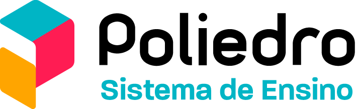

# 🤖 Chatbot Poliedro

Bem-vindo ao repositório do **Chatbot Poliedro**, um projeto interdisciplinar desenvolvido por alunos do curso de Ciências da Computação do Instituto Mauá de Tecnologia. Este sistema visa otimizar o atendimento nos restaurantes das escolas Poliedro, reduzindo filas e aprimorando a comunicação entre clientes e cozinha.

---

## 📖 Descrição do Projeto

O **Chatbot Poliedro** é um sistema de atendimento automatizado que utiliza inteligência artificial para receber e gerenciar pedidos de forma eficiente. Foi concebido para mitigar problemas de longas filas e atrasos no atendimento, particularmente durante períodos de alta demanda.

### 🎯 Objetivos do Sistema

-   Otimizar o tempo de resposta no processo de registro de pedidos.
-   Facilitar a comunicação dos pedidos para a equipe da cozinha.
-   Reduzir o tempo de espera em filas e melhorar a experiência geral de atendimento no restaurante.

---

## 🛠️ Tecnologias Empregadas

Este projeto utiliza uma combinação de tecnologias para o frontend, backend e ferramentas de desenvolvimento:

### Frontend (Interface do Chat e Painel KDS/Admin)

-   **HTML5**: Estruturação das páginas web ([`chatbot/index.html`](chatbot/index.html), [`chatbot/kds.html`](chatbot/kds.html)).
-   **CSS3**: Estilização e layout visual ([`chatbot/style.css`](chatbot/style.css), [`chatbot/kds.css`](chatbot/kds.css)).
-   **JavaScript (ES6+)**: Interatividade do chat, manipulação do DOM, comunicação com o backend e lógica do KDS/Admin ([`chatbot/script.js`](chatbot/script.js), [`chatbot/kds.js`](chatbot/kds.js)).
-   **Font Awesome**: Biblioteca de ícones.
-   **Browser Local Storage**: Armazenamento local de pedidos pendentes e itens do cardápio no KDS/Admin.

### Backend (Servidor e Integração LLM)

-   **Python**: Linguagem principal para o servidor.
-   **Flask**: Microframework web para a API RESTful ([`chatbot/python-flask-llm-chatbot/src/app.py`](chatbot/python-flask-llm-chatbot/src/app.py)).
-   **Flask-CORS**: Middleware para habilitar requisições Cross-Origin Resource Sharing (CORS).
-   **Requests**: Biblioteca para realizar chamadas HTTP para a API do LLM ([`chatbot/python-flask-llm-chatbot/src/llm/integration.py`](chatbot/python-flask-llm-chatbot/src/llm/integration.py)).
-   **Ollama**: Plataforma externa para execução local de Modelos de Linguagem Grandes (LLMs), como o `deepseek-r1` (requer instalação e execução separadas).

### Banco de Dados (Planejado)

-   **MongoDB**: Previsto para armazenamento persistente de dados (atualmente não implementado).

### Ferramentas Auxiliares

-   **Git**: Sistema de controle de versão.
-   **Trello**: Ferramenta externa para gerenciamento de projetos.
-   **Ambiente Virtual Python (`venv`)**: Isolamento de dependências do projeto Python.

---

## 🚀 Configuração e Execução

### Pré-requisitos

-   Git instalado.
-   Python 3.x instalado.
-   Ollama instalado e em execução ([https://ollama.com/](https://ollama.com/)).

### Passos

1.  **Clone o repositório:**
    ```bash
    git clone <URL do seu repositório>
    cd chatbot-poliedro
    ```

2.  **Configure o Backend:**
    *   Navegue até o diretório do backend:
        ```bash
        cd chatbot/python-flask-llm-chatbot
        ```
    *   Crie e ative um ambiente virtual:
        ```bash
        # Criar (apenas uma vez)
        python -m venv venv
        # Ativar (Windows)
        venv\Scripts\activate
        # Ativar (macOS/Linux)
        source venv/bin/activate
        ```
        *(Use `deactivate` para sair do ambiente virtual)*
    *   Instale as dependências Python:
        ```bash
        pip install -r requirements.txt
        ```
    *   Baixe o modelo LLM necessário via Ollama (certifique-se que o Ollama está rodando):
        ```bash
        ollama pull deepseek-r1
        ```
        *(O modelo padrão é `deepseek-r1`, configurado em `src/app.py`. O backend espera que o Ollama esteja acessível em `http://localhost:11434`)*

3.  **Execute o Backend:**
    *   Ainda no diretório `chatbot/python-flask-llm-chatbot` e com o ambiente virtual ativado:
        ```bash
        python src/app.py
        ```
    *   O servidor Flask iniciará (geralmente em `http://localhost:5000`).

4.  **Acesse o Frontend:**
    *   Abra o arquivo [`chatbot/index.html`](chatbot/index.html) diretamente no seu navegador. Ele se conectará automaticamente ao backend em execução.
    *   O painel KDS/Admin pode ser acessado abrindo [`chatbot/kds.html`](chatbot/kds.html).

---

## 🧑‍💻 Equipe de Desenvolvimento

Este projeto foi conduzido por uma equipe de alunos do curso de Ciências da Computação do Instituto Mauá de Tecnologia, utilizando o framework ágil **SCRUM**. A estrutura da equipe foi organizada da seguinte forma:

-   **Product Owner (PO)**: Thiago
-   **Scrum Master**: Arthur Trindade
-   **Desenvolvedores**:
    -   Murilo Rodrigues
    -   Pedro Henrique
    -   Henrique Impastaro

---

## Contexto Institucional

Este projeto foi desenvolvido como parte das atividades acadêmicas do **Instituto Mauá de Tecnologia (IMT)**, visando uma aplicação prática no ambiente do **Sistema de Ensino Poliedro**.

| **Instituição de Ensino**                                    | **Instituição Parceira (Aplicação)**                                      |
| :----------------------------------------------------------: | :-----------------------------------------------------------------------: |
|  |  |


